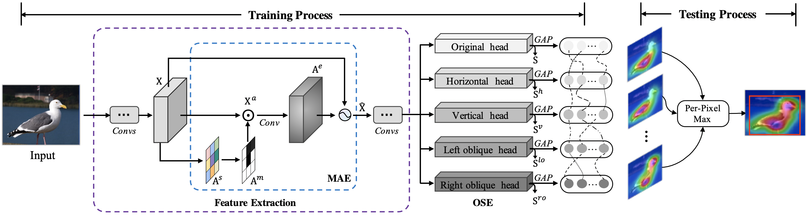

# E2Net: Excitative-Expansile Learning for Weakly Supervised Object Localization (ACM MM 2021)

Tensorflow implementation of ''E2Net: Excitative-Expansile Learning for Weakly Supervised Object Localization''.

## 📋 Table of content
 1. [📎 Paper Link](#1)
 2. [💡 Abstract](#2)
 3. [📖 Method](#3)
 4. [📃 Requirements](#4)
 5. [✏️ Usage](#5)
    1. [Start](#51)
    2. [Prepare Datasets](#52)
    3. [Training&Testing](#53)
 6. [🔍 Citation](#6)

## 📎 Paper Link <a name="1"></a> 
> E2Net: Excitative-Expansile Learning for Weakly Supervised Object Localization ([link](https://dl.acm.org/doi/pdf/10.1145/3474085.3475211))
* Authors: Zhiwei Chen, Liujuan Cao, Yunhang Shen, Feihong Lian, Yongjian Wu, Rongrong Ji
* Institution: Xiamen University, Xiamen, China. Tencent Youtu Lab, Shanghai, China.

## 💡 Abstract <a name="2"></a> 
Weakly supervised object localization (WSOL) has gained recent popularity, which seeks to train localizers with only image-level labels. However, due to relying heavily on classification objective for training, prevailing WSOL methods only localize discriminative parts of object, ignoring other useful information, such as the wings of a bird, and suffer from severe rotation variations. Moreover, learning object localization imposes CNNs to attend non-salient regions under weak supervision, which may negatively influence image classification results. To address these challenges, this paper proposes a novel end-to-end Excitation-Expansion network, coined as E2Net, to localize entire objects with only image-level labels, which served as the base of most multimedia tasks. The proposed E2Net consists of two key components: Maxout-Attention Excitation (MAE) and Orientation-Sensitive Expansion (OSE). Firstly, MAE module aims to activate non-discriminative localization features while simultaneously recovering discriminative classification cues. To this end, we couple erasing strategy with maxout learning efficiently to facilitate entire-object localization without hurting classification accuracy. Secondly, to address rotation variations, the proposed OSE module expands less salient object parts along with all possible orientations. Particularly, OSE module dynamically combines selective attention banks from various orientated expansions of receptive-field, which introduces additional multi-parallel localization heads. Extensive experiments on ILSVRC 2012 and CUB-200-2011 demonstrate that the proposed E2Net outperforms the previous state-of-the-art WSOL methods and also significantly improves classification performance.

## 📖 Method <a name="3"></a> 

<p align="center">
     <br />
    <em> 
    </em>
</p>
The architecture of our proposed network. There are two main components: Maxout-Attention Excitation (MAE) and Orientation-Sensitive Expansion (OSE). MAE is applied to intermediate feature maps of the backbone in a sequential way. The output maps of multi-parallel localization heads in OSE are fused during the test phase. Note that GAP refers to global average pooling.

## 📃 Requirements <a name="4"></a> 
  - Python 3.3+ 
  - Tensorflow (≥ 1.12, < 2)

## ✏️ Usage <a name="5"></a> 

### Start <a name="51"></a> 

```bash  
git clone https://github.com/zhiweichen0012/E2Net.git
cd E2Net
```

### Download Datasets <a name="52"></a> 

* CUB ([http://www.vision.caltech.edu/visipedia/CUB-200-2011.html](http://www.vision.caltech.edu/visipedia/CUB-200-2011.html))

Run the following command to download original CUB dataset and extract the image 
files on `root` directory.
```bash
./dataset/prepare_cub.sh
```
The structure of image files looks like
```
dataset
└── CUB
    └── 001.Black_footed_Albatross
        ├── Black_Footed_Albatross_0001_796111.jpg
        ├── Black_Footed_Albatross_0002_55.jpg
        └── ...
    └── 002.Laysan_Albatross
    └── ...
```
Corresponding annotation files can be found in [here](labels/CUB).


* ILSVRC ([https://www.image-net.org/challenges/LSVRC/](https://www.image-net.org/challenges/LSVRC/))

To prepare ImageNet data, download ImageNet "train" and "val" splits from 
[here](http://www.image-net.org/) and put the downloaded file on 
`dataset/ILSVRC2012_img_train.tar` and `dataset/ILSVRC2012_img_val.tar`.
Then, run the following command on `root` directory to extract the images. 
```bash
./dataset/prepare_imagenet.sh
```

The structure of image files looks like
```
dataset
└── ILSVRC
    └── train
        └── n01440764
            ├── n01440764_10026.JPEG
            ├── n01440764_10027.JPEG
            └── ...
        └── n01443537
        └── ...
    └── val
        ├── ILSVRC2012_val_00000001.JPEG
        ├── ILSVRC2012_val_00000002.JPEG
        └── ...
```
Corresponding annotation files can be found in [here](labels/ILSVRC).


### Training & Testing <a name="53"></a> 

First download pretrained models from [here](http://models.tensorpack.com/). Currently, we provide [ResNet50-SE](http://models.tensorpack.com/ResNet/ImageNet-ResNet50-SE.npz)  and [VGG-16](http://models.tensorpack.com/Caffe-Converted/vgg16.npz) networks. 
Then, run the following command on `root` directory.

```bash
./run_train_vgg16.sh
./run_train_resnet50.sh
```

## 🔍 Citation <a name="6"></a> 

```
@inproceedings{chen2021e2net,
  title={E2Net: Excitative-Expansile Learning for Weakly Supervised Object Localization},
  author={Chen, Zhiwei and Cao, Liujuan and Shen, Yunhang and Lian, Feihong and Wu, Yongjian and Ji, Rongrong},
  booktitle={ACM MM},
  pages={573--581},
  year={2021}
}
```

